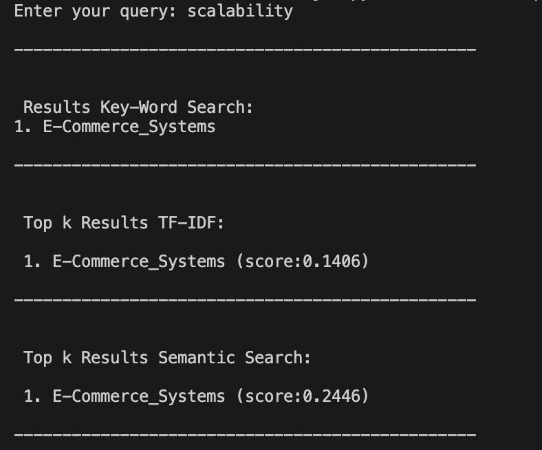

# Khoj

## Currently under Development

Khoj is a search engine built from scratch to learn and implement Information Retrieval concepts, starting with keyword search and gradually progressing to semantic search, hybrid retrieval, and Retrieval-Augmented Generation (RAG).

## Current Progress

- Inverted Index
- Keyword Search
- TF-IDF
- Cosine Similarity
- Vector Space Model (VSM)
- Semantic Search
- Sentence Embeddings
- Document Embedding Storage

The project currently compares classical keyword-based retrieval with semantic retrieval on the same query.

  

_Current console output showing Keyword Search, TF-IDF ranking, and Semantic Search results._

At this stage, Khoj supports both traditional lexical retrieval (keyword search and TF-IDF) and modern semantic retrieval using sentence embeddings. The project is being built incrementally so that each retrieval technique is understood before moving on to more advanced approaches.

## Planned Features

- Vector Database (FAISS)
- Hybrid Search
- Retrieval-Augmented Generation (RAG)
- Result Comparison
- FastAPI Backend
- React Frontend

## Goal

The objective of this project is to understand how modern search engines work by implementing each retrieval technique from scratch wherever practical. The project starts with classical Information Retrieval concepts and progressively evolves into a semantic search system powered by vector embeddings, hybrid retrieval, and Retrieval-Augmented Generation (RAG).
